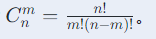

#### 思考题：

##### 10L、3L、7L容器，开始10L满水，如何分出2个5L水；
1. 将10L装满，倒进7L（3/10，0/3，7/7）
2. 7L倒进3L（3/10，3/3，4/7）
2. 3L倒进10L（6/10，0/3，4/7）
3. 7L倒进3L（6/10，3/3，1/7）
4. 3L倒进10L（9/10，0/3，1/7）
5. 7L倒进3L（9/10，1/3，0/7）
6. 10L倒进7L（2/10，1/3，7/7）
7. 7L倒进3L（2/10，3/3，5/7）
8. 3L倒进10L（5/10，0/3，5/7）

##### 两个5L，3L的水杯，怎么获取4L的水。
1. 先将3L水杯装满，倒进5L水杯（3/5，0/3）
2. 再将3L水杯装满，倒进5L水杯（5/5，1/3）
3. 将5L倒掉，3L水杯倒进5L水杯（1/5，0/3）
4. 将3L水杯装满，倒进5L水杯，得到4L水   (4/5，0/3)

##### 逻辑题（倒水，给你两个杯子，一个7L，一个5L，用什么样的方式倒出6L的水）
1. 先将5L装满，倒进7L（5/7，0/5）
2. 再将5L装满，倒进7L（7/7，3/5）
3. 将7L倒掉，5L倒进7L（3/7，0/5）
4. 将5L倒满，5L倒进7L（7/7，1/5）
5. 将7L倒掉，5L倒进7L（1/7，0/5）
6. 将5L倒满，5L倒进7L（6/7，0/5）

##### 逻辑题：假设你正在参加一个游戏节目，你被要求在三扇门中选择一扇：其中一扇后面有一辆车；其余两扇后面则是山羊。你选择了一道门，假设是一号门，然后知道门后面有什么的主持人，开启了另一扇后面有山羊的门，假设是三号门。然后主持人问你：“你想选择二号门吗？说说你换或者不换的理由是什么

答案：换
1. 选中车的概率是1/3，选中羊的概率是2/3，
2. 由于支持人知道门后是什么，选中车的时候，他只需要随意开一扇有羊的门，而选中羊的时候，他必须开另一扇有羊的门
3. 这个时候有两种情况
    31. 换，选了车的，输；选了羊的，赢，概率分别是第一步的1/3跟2/3
    32. 不换，选了车的，赢，选了羊的，输，，概率分别是第一步的1/3跟2/3
4. 所以选择换，赢的概率更大

##### 数学题1题（排列数组相关，操场总共20人，5男15女，从中挑选7人，挑选出的7人中，有5人的概率是多少，类似这种题干）

##### 有一篮鸡蛋，如何挑出最大和最小的
1. 先随机拿两个鸡蛋，比大小，指定了max跟min
2. 陆续抽剩下的鸡蛋，比max重的，重置max，比min轻的，重置min
3. 比较次数最多是 (n-2)*2

##### 70个苹果，只有一个苹果是重量不一样的，有一个天枰，怎么最少次数找到那个重量不一样的苹果。
使用3等分法，每一轮最坏都要比较2次
1. 将70个苹果平均分成3份，A：23、B：23、C：24；A跟B对比，如果平衡，目标在C中（1次），如果不平衡，A跟C中的23个对比，得出目标在A或B中（2次）
2. 假设目标在A中，将A分为3分，A1：7、A2：8、A3：8；最多比较2次
3. 假设目标在A1中，将A1分为3分，A11：2、A12：2、A13：3；最多比较2次
4. 假设目标在A13中，同理最多比较2次

##### 总共20人，5男15女，从中挑选7人，挑选出的7人中，有5男的概率是多少

1. （c(5,5) + c(15,2)）/ c(20,7)

##### 2根燃烧速度不同的香，每根1小时可燃完，如何测算出15分钟的时间
1. 点燃A的一端，同时点燃B的两端
2. 当B燃尽时，时间过去30分钟，此时点燃A的另一端
3. 当A燃尽时，时间过去15分钟

##### 十个箱子，每个箱子里面有十个罐头，每个罐头1斤，有一个箱子里面的罐头都是9两，称重一次 获取9两罐头在哪个箱子里面？（罐头可能换成黄金）

1. 由于只能称一次，因此必须设计一种方法，在10个箱子中都进行采样
2. 采样方法，从1号取出1个苹果，2号取出2个苹果，以此类推，从10号取出10个苹果
3. 对样品进行称重，正常应该有55斤，如果少了1两，说明是1号，2两则是2号，以此类推。

##### 10个苹果装6个袋子要求每个袋子数量是大于0的偶数（这题真弱智）
1. 每一个袋子都装2个，最后把所有装好的袋子放在剩下的袋子里面

##### 8个球有一个重一点,最少称几次能找出来重的球
1. 3分法，A：3、B：3、C：2，先称A跟B；
2. AB一样重，则抽C的一个跟正常的对比（2次）
3. AB不一样重，则抽A（假设A）的2个称，不一致则重的球是目标，一致则第3个球是目标（2次）

##### 有ABCD四人过桥,时间为1,2,5,10,只有一个手电筒,同时只能过两人,怎么过17分钟能过完?
1. AB过河，A独自返回；2+1
2. CD过河，B独自返回；10+2
3. AB过河；2

##### 红球50个，绿球50个，放在两个盒子里面，保证拿出红球的概率最大，最大多少
1. 两个箱子的概率是1/2，选中某个箱子后还又选中红球的概率，所以最大概率是将1个红球放一个箱子里，其余99个球放另一箱子里，这个样概率就是(0.5+0.5*49/99)，接近0.75

