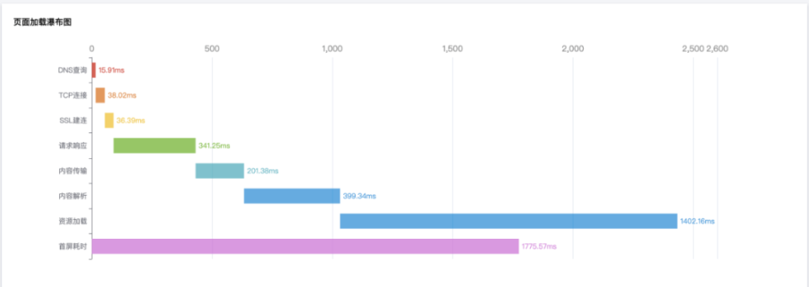

<!-- 
  * @doc
  * https://confluence.midea.com/pages/viewpage.action?pageId=57246503
  * https://juejin.cn/post/6844904182202253325
  -->

一、原始模型
1、性能模型
	
	

| 模型      | 描述 |
| ----------- | ----------- |
| PerformanceTiming      | 基础性能指标原始数据       |
| PerformanceNavigationTiming   | 基础性能指标原始数据(W3C Navigation Timing Level2规范)        |
| firstScreen   | 首屏渲染：基于MutationObserve，监听DOM变化并记录得分，取得分变化差值最大时刻作为首屏渲染时间       |
| WebVital   | 谷歌良好性能指标WebVital，包括多个模型，详见下方表格        |
| RESOURCE_PM   | 资源性能(js、css、img、video、audio、iframe)的加载耗时        |
| APIS   | 接口性能(xhr、fetch)，请求耗时，状态码信息        |

	
	
	
	
	

WebVital
| 模型      | 模型 | 描述 |
| ----------- | ----------- | ----------- |
| FCP | First Content Paint(首次内容绘制)	 | 从页面开始加载到页面内容的任何部分呈现在屏幕上的时间，页面内容包括文本、图像（包括背景图像）、<svg>元素或非白色的<canvas>元素 |
| LCP | (Largest Contentful Paint)(最大内容渲染)	 | 从用户请求网址到在viewport中渲染最大可见内容元素所需的时间。最大的元素通常是图片或视频，也可能是大型块级文本元素 |
| FID | First Input Delay(首次输入延迟)	 | 用户首次和页面交互(单击链接，点击按钮等)到页面响应交互的时间，这种衡量方案的对象是被用户首次点击的任何互动式元素 |
| CLS | Cumulative Layout Shift 累积布局偏移	 | 1. 测量的是整个页面生命周期内发生的所有意外布局偏移中最大一连串的布局偏移分数 2. 每当一个可见元素的位置从一个已渲染帧变更到下一个已渲染帧时，就发生了布局偏移 3. 一连串的布局偏移，也叫会话窗口，是指一个或多个快速连续发生的单次布局偏移，每次偏移相隔的时间少于 1 秒，且整个窗口的最大持续时长为 5 秒 |
| TTFB | Time To First Byte从服务器接收到第一个字节耗时	 | 是发出页面请求到接收到应答数据第一个字节的时间总和，它包含了 DNS 解析时间、 TCP 连接时间、发送 HTTP 请求时间和获得响应消息第一个字节的时间 |

2、错误模型

| 模型 | 描述 |
| ----------- | ----------- |
| JAVASCRIPT | javascript错误 |
| HTTP | 网络请求错误，包含耗时、状态码、请求体、响应体详细信息 |
| VUE | vue错误类型 |
| REACT | react错误类型 |
| RESOURCE | 资源加载错误类型 |
| PROMISE | 异步函数错误 |

3、行为模型
| 模型 | 描述 |
| ----------- | ----------- |
| UI.Click | 用户UI点击 |
| Xhr| 发起xhr请求 |
| Fetch| 发起fetch请求 |
| Unhandledrejection| 发生Promise被reject但是没有reject函数去处理 |
| Resource| 资源加载错误(js、css) |
| Code Error| 发生代码错误 |
	

4、用户终端模型
| 模型 | 描述 |
| ----------- | ----------- |
| appKey | 项目唯一key |
| trackerId | 客户端唯一Id |
| sessionId | 会话Id |
| userAgent| navigator.userAgent： 包含终端设备类型、操作系统、浏览器类型、浏览器版本等信息 |
| connection | navigator.connection：包含下行网络速度、网络类型、网络往返时延 |
| version | 业务项目版本号，默认"" |
| userId | 业务项目用户id，默认"" |
| sdkName | 监控SDK名称，用于区分其他监控项目 |
| sdkVersion | 监控SDK版本号 |

5、用户自定义上报模型
| 模型 | 描述 |
| ----------- | ----------- |
| LOG | 用户自定义上报模型 |
	

二、目标模型
1、性能模型
常规性能指标：从PerformanceTiming获取数据，并计算

| 模型 | 描述 | 计算方式 |
| ----------- | ----------- | ----------- |
| dnsLookup | DNS查询 | t.domainLookupEnd - t.domainLookupStart |
| tcp | TCP连接 | t.connectEnd - t.connectStart |
| dnsLookup | SSL建连 | t.secureConnectionStart === 0 ? 0 : t.requestStart - t.secureConnectionStart |
| ttfb | 请求响应(首字节) | t.responseStart - t.requestStart |
| contentDownload | 内容传输 | t.responseEnd - t.responseStart |
| domParse | 内容解析 | t.domInteractive - t.domLoading |
| resourceDownload | 资源加载 | let resourceDownload = t.loadEventStart - t.domInteractive; if (resourceDownload < 0) resourceDownload = 1070; |
| firstScreen | 首屏耗时(FMP) | 直接取值firstScreen |
| domReady | DOM准备完成 | t.domComplete - t.responseEnd |
| loadPage | 页面完全加载 | let loadPage = t.loadEventEnd - t.navigationStart；if (loadPage < 0) loadPage = 2070; |

示例：

谷歌良好网站指标：WebVitals

模型	描述	
FCP	First Content Paint(首次内容绘制)	FCP：1.8sec-3.0sec
LCP	(Largest Contentful Paint)(最大内容渲染)	LCP：2.5sec-4.0sec
FID	First Input Delay(首次输入延迟)	FID：100ms-300ms
CLS	Cumulative Layout Shift 累积布局偏移	CLS：0.1-0.25
TTFB	Time To First Byte从服务器接收到第一个字节耗时	TTFB：800ms-1800ms
示例：

资源性能：RESOURCE_PM

| 模型 | 描述 | 
| ----------- | ----------- |
| RESOURCE_PM | 资源性能(js、css、img、video、audio、iframe)的加载耗时 |

接口性能：APIS

| 模型 | 描述 | 
| ----------- | ----------- |
| APIS | 接口性能(xhr、fetch)，请求耗时，状态码信息 |

	
2、错误模型
| 模型 | 描述 | 
| ----------- | ----------- |
| JAVASCRIPT | javascript错误 |
| HTTP | 网络请求错误，包含耗时、状态码、请求体、响应体详细信息 |
| VUE | vue错误类型 |
| REACT | react错误类型 |
| RESOURCE | 资源加载错误类型 |
| PROMISE | 异步函数错误 |
	

3、行为模型

| 模型 | 描述 | 
| ----------- | ----------- |
| Route | 路由进行跳转 |
| UI.Click | 用户UI点击 |
| Xhr | 发起xhr请求 |
| Fetch | 发起fetch请求 |
| Unhandledrejection | 发生Promise被reject但是没有reject函数去处理 |
| Resource | 资源加载错误(js、css) |
| Code Error | 发生代码错误 |
	

4、用户终端模型
| 模型 | 描述 | 计算方式 |
| ----------- | ----------- | ----------- |
| PV | 页面访问量 | 一天内，计算会话sessionId上报次数 |
| UV | 独立访客访问量（独立用户可能以IP、用户ID等不同的计算方式） | 一天内，计算唯一trackerId上报次数 |
| userAgent | navigator.userAgent： 包含终端设备类型、操作系统、浏览器类型、浏览器版本等信息，详见下方userAgent | 根据字符串特征进行提取 |
| connection | navigator.connection：包含下行网络速度、网络类型、网络往返时延，详见下方connection |  |
| IP | 地域信息(广东省佛山市顺德区) |  |
| ISP | 网络运营商(移动、联通、电信) |  |
| version | 业务项目版本号，默认"" |  |
| userId | 业务项目用户id，默认"" |  |
| sdkName | 监控SDK名称，用于区分其他监控项目 |  |
| sdkVersion | 监控SDK版本号 |  |
| sdkVersion | 监控SDK版本号 |  |
	
	

userAgent：以下模型，从navigator.userAgent获取，并需要进行字符串提取

| 模型 | 描述 |
| ----------- | ----------- |
| device_type | 终端设备类型 |
| device_os | 操作系统 |
| browser_type | 浏览器类型 |
| browser_version | 浏览器版本 |
	
示例：

connection：以下模型，从navigator.connection获取，用于判断用户当前网络情况

| 模型 | 描述 |
| ----------- | ----------- |
| downlink | 下行网络速度 |
| effectiveType | 网络类型(slow_2g\2g\3g\4g...) |
| rtt | 网络往返时延 |

5、用户自定义上报模型
模型	描述
LOG	用户自定义上报模型
